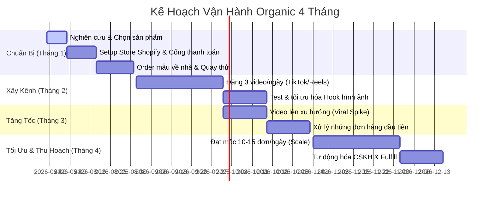
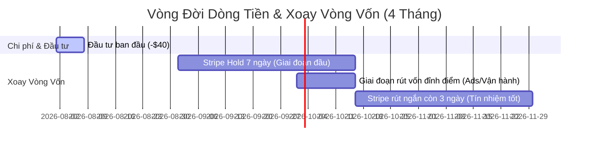

# Case Study: Phân Tích Ví Dụ Thực Tế Đang Chạy (Case Study: Solume)

Để hiểu rõ cách áp dụng quy trình vào thực tế, chúng ta sẽ phân tích một cửa hàng dropship thực tế đang hoạt động rất tốt trong ngách thiết bị phòng ngủ thẩm mỹ (Aesthetic Bedroom Sleep-tech).

---

## 1. Phân Tích Cửa Hàng (Store Analysis)

- **Website**: [mysolume.com](https://mysolume.com/products/solume)
- **Sản phẩm chính**: **SOLUME™ – Sunrise Wake Light** (Đèn báo thức giả lập bình minh kết hợp loa Bluetooth và cảnh biển 3D).
- **Mô tả thiết kế**:
  - Cấu tạo gồm phần khung giả vân gỗ, có một cửa sổ góc nghiêng chứa mô hình 3D (diorama) bờ biển đá và một cánh buồm nhỏ.
  - Phần đế bọc vải chứa màn hình LED hiển thị đồng hồ, tích hợp loa Bluetooth và 12 loại âm thanh tự nhiên (tiếng mưa, sóng biển, tiếng chim hót,...).
  - Đèn LED phía sau mô hình sẽ chuyển màu từ cam ấm sang vàng sáng để giả lập bình minh khi báo thức, hoặc mờ dần (sunset timer) để đưa người dùng vào giấc ngủ.
- **Mức định giá (Pricing)**:
  - Bản Classic: **$78.00 CAD** (khoảng $57 USD ~ 1.450.000 VNĐ).
  - Bản Pro: **$85.00 CAD** (khoảng $62 USD ~ 1.580.000 VNĐ).
- **Bí mật kỹ thuật (Backend Tech)**:
  - Store được dựng trên nền tảng **Shopify**.
  - Cửa hàng sử dụng nhà cung ứng **Zendrop** làm đối tác fulfill (xác nhận thông qua file mã nguồn `zendrop.js` và tên theme hoạt động của store là `Copy of Copy of Copy of Zendrop`). Điều này chứng tỏ họ không đặt hàng thủ công trên AliExpress mà dùng cổng sỉ của Zendrop để có thời gian ship nhanh hơn (thường từ 5-10 ngày tới Mỹ).

---

## 2. Chiến Lược Mạng Xã Hội (Social Media Strategy)

### Kênh TikTok chính: [@fireehome](https://www.tiktok.com/@fireehome)

- **Góc tiếp cận (Angle)**:
  - Tập trung vào phong cách sống (Lifestyle), decor phòng ngủ ấm cúng (Cozy Bedroom Aesthetic) và trải nghiệm thức dậy không tiếng ồn khó chịu.
  - Các video thường quay cảnh phòng ngủ tối, sau đó đèn Solume bật lên chiếu sáng mô hình cánh buồm lung linh, kết hợp với nhạc nền ASMR nhẹ nhàng, thư giãn.
- **Định hướng traffic**: Dẫn người xem click vào link ở tiểu sử (bio link) để mua đèn.

### Các kênh Social khác (Instagram, Pinterest,...)

- **Thực tế**: Đối với các cửa hàng dropship một sản phẩm (One-Product Dropshipping), các nhà bán hàng thường tối ưu **90% nguồn lực vào TikTok** (nơi dễ ăn đề xuất tự nhiên nhất đối với định dạng video ngắn).
- Do đó, thương hiệu này không tập trung phát triển mạnh Instagram hữu cơ (Organic Instagram). Tuy nhiên, nếu bạn muốn phủ rộng hơn, bạn có thể tạo tài khoản Instagram với tên tương tự (ví dụ: `@solume.official` hoặc `@fireehome`) và re-up lại toàn bộ các video từ TikTok lên Reels, đính kèm hashtags tiếng Anh để kéo thêm tệp khách hàng từ Instagram.

---

## 3. Nguồn Tìm Nhà Cung Cấp Trên AliExpress (AliExpress Sourcing)

Do "Solume" chỉ là thương hiệu riêng (Private Label) do chủ store tự đặt, bạn sẽ không tìm thấy sản phẩm này dưới tên "Solume" trên AliExpress. Tuy nhiên, đây là một sản phẩm sản xuất hàng loạt tại Trung Quốc.

### Cách tìm nguồn sỉ sản phẩm này:

1. **Tìm kiếm bằng hình ảnh (AliExpress Image Search)**:
   - Tải ảnh sản phẩm chính từ store Solume (ví dụ ảnh: `http://mysolume.com/cdn/shop/files/solume_22.png`).
   - Mở ứng dụng AliExpress trên điện thoại di động, bấm vào biểu tượng máy ảnh ở thanh tìm kiếm và tải ảnh này lên.
   - Hệ thống sẽ tự động quét và trả về các nhà sản xuất/nhà bán sỉ đang bán chiếc đèn này.
2. **Tìm kiếm bằng từ khóa (Keywords)**:
   - Sử dụng các từ khóa sau trên AliExpress hoặc 1688 để tìm:
     - `"sunrise alarm clock sailboat"`
     - `"coastal diorama wake up light"`
     - `"diorama alarm clock bluetooth speaker"`
     - `"creative ocean wave bedside lamp"`

- Biên lợi nhuận thực tế đạt khoảng **$32 - $39 USD** trên mỗi sản phẩm bán ra (tương đương biên lợi nhuận cực tốt > 55%).

---

## 4. Đánh Giá Tỷ Lệ Áp Dụng Quy Trình Của Solume (Đối Chiếu Với Quy Trình Chuẩn)

Dựa trên tài liệu [00-2-quytrinh.md](file:///Users/aminhp93/personal/githubcoffee/githubcoffee/public/dropship/2026/00-overview/00-2-quytrinh.md), mức độ hoàn thiện quy trình của Solume đạt khoảng **88.5%**:

1. **Bước 1: Tìm sản phẩm (Product Research) - Đạt 100%**:
   - Đèn Sunrise Wake Light giải quyết nỗi đau thức dậy mệt mỏi (Sleep-tech / Sleep Quality).
   - Sản phẩm mang tính "Wow factor" cực cao nhờ mô hình 3D bờ biển và chuyển động ánh sáng mượt mà.
   - Nhẹ, gọn, khó vỡ hơn hàng thủy tinh, markup biên lợi nhuận lớn (>55%).
2. **Bước 2: Thiết lập Store (Store Setup) - Đạt 90%**:
   - Dựng Landing Page tối giản trên Shopify (dùng theme Copy of Copy of Zendrop).
   - Mobile UX tối ưu, tập trung vào hình ảnh ấm cúng của phòng ngủ ban đêm.
   - Sử dụng review thực tế có kèm ảnh từ AliExpress để làm social proof.
3. **Bước 3: Sản xuất Content (Content Production) - Đạt 95%**:
   - Mua sản phẩm về nhà tự quay video thực tế trên kênh TikTok `@fireehome`.
   - Cấu trúc video chuẩn chỉnh: 3s đầu (Hook căn phòng tối bật đèn chuyển màu cam ấm) -> Body (ASMR tiếng sóng biển, loa bluetooth) -> CTA (Click link in bio).
4. **Bước 4: Kéo Traffic tự nhiên (Organic Publishing) - Đạt 80%**:
   - Tần suất đăng bài đều đặn trên TikTok. Tuy nhiên, điểm yếu là chưa phủ mạnh sang Reels và Shorts để tận dụng tối đa đa nền tảng.
5. **Bước 5: Xử lý đơn hàng (Fulfillment) - Đạt 90%**:
   - Liên kết trực tiếp hệ thống tự động qua Zendrop để tối ưu thời gian giao hàng (5-10 ngày tới Mỹ), bỏ qua bẫy ship chậm của AliExpress truyền thống.
6. **Bước 6: Nhận tiền & Dòng tiền (Payment & Cash Flow) - Đạt 85%**:
   - Tích hợp cổng Stripe/PayPal cho thị trường quốc tế (US/CA).
7. **Bước 7: Chăm sóc khách hàng (Customer Service) - Đạt 80%**:
   - Có hệ thống tracking Zendrop tự động gửi mail cho khách để giảm tải CSKH.

---

## 5. Phân Tích Số Liệu Thực Tế (Spy Data Review)

Dựa trên dữ liệu thu thập được từ công cụ Spy (tính đến tháng 5/2026):

### A. Chỉ số Traffic (Lưu lượng truy cập)

- **Monthly Visits**: **13.3K lượt truy cập/tháng** (đạt đỉnh vào tháng 5/2026).
- **Biểu đồ Traffic**: Giai đoạn từ 08/2025 đến 02/2026 gần như bằng 0 (flatline) vì lúc này store đang bán sản phẩm cũ (Auto Privacy Curtains) không thành công. Ngay khi họ pivot sang sản phẩm **Sunrise Wake Light** vào cuối tháng 3/2026, lượng traffic tăng vọt thẳng đứng trong 2 tháng (từ 0 lên 13.3K).
- **Bounce Rate (Tỷ lệ thoát)**: **90.24%** (Rất cao).
  - _Lý giải_: Với mô hình One-Product Store chạy qua TikTok Organic, khách hàng click vào link tiểu sử chỉ để xem giá của duy nhất 1 sản phẩm. Họ không có nhu cầu duyệt các trang khác (Pages per Visit chỉ đạt 1.06).
  - _Cảnh báo_: Mức 90% cũng báo hiệu trang web có thể tải chậm hoặc giá bán $54.9 - $78.0 CAD gây sốc nhiệt cho người mua.
- **Địa lý**: **80.18% đến từ Mỹ (United States)**. Đây là tệp khách hàng có sức mua lớn nhất, sẵn sàng trả trên $50 cho một sản phẩm decor decor.

### B. Chỉ số Doanh số & Doanh thu (Sales & Revenue)

- **Monthly Sales**: **351 đơn hàng/tháng**.
- **Doanh thu hàng tháng (Revenue)**: Khoảng **$10,200 USD/tháng** (số liệu Spy định giá dựa trên mức giá trung bình của store. Thực tế nếu bán thuần sản phẩm Sunrise Light giá $54.9 USD, doanh thu thực tế có thể dao động quanh mức **$15,000 - $19,000 USD**).
- **Ad Pixels**: `--` (Không có). Điều này xác nhận cửa hàng **hoàn toàn chạy bằng Organic Traffic (không tốn chi phí quảng cáo)**.

### C. Biên Lợi Nhuận Thực Tế (Unit Economics)

- **Giá bán lẻ (Retail Price)**: $54.90 USD (Bản Classic).
- **Giá nhập + Phí ship Zendrop (COGS)**: ~$22.00 USD.
- **Phí cổng thanh toán (Stripe/PayPal ~5%)**: ~$2.75 USD.
- **Lợi nhuận ròng trên 1 sản phẩm**: $54.90 - $22.00 - $2.75 = **$30.15 USD / đơn hàng**.
- **Biên lợi nhuận ròng (Net Margin)**: **54.9%** (Mức biên cực kỳ lý tưởng nhờ không mất tiền chạy Ads).
- **Lợi nhuận ròng hàng tháng (Net Profit)**:
  - Ở mức doanh thu $10,200 USD: **~$5,600 USD/tháng (~142 triệu VNĐ)**.
  - Ở mức doanh thu thực tế ước tính ($19,000 USD): **~$10,500 USD/tháng (~267 triệu VNĐ)**.

---

## 6. Timeline Vận Hành Và Kế Hoạch Vốn Cho Newbie (Chu kỳ 4 tháng Organic)

Để đạt được con số ~350 đơn hàng/tháng như Solume sau 4 tháng bằng nguồn traffic tự nhiên, đây là lộ trình thực tế:

### A. Timeline triển khai (4 Tháng)

- **Tháng 1 (Chuẩn bị)**: Chọn ngách Sleep-tech, dựng store Shopify, mua tên miền. Đặt 1 mẫu đèn Sunrise Light từ AliExpress về nhà (mất 7-10 ngày). Tập quay các clip ASMR trong phòng tối.
- **Tháng 2 (Nuôi kênh)**: Đăng liên tục 3 video/ngày lên TikTok, IG Reels và Shorts. Tần suất là chìa khóa. Giai đoạn này chỉ đạt 200-500 views mỗi video. Tập trung tối ưu 3s đầu (Hook).
- **Tháng 3 (Đề xuất)**: 1-2 video may mắn cắn xu hướng (>100K views). Lượng click vào link bio tăng vọt. Phát sinh 2-5 đơn/ngày.
- **Tháng 4 (Gặt hái)**: Kênh đạt độ uy tín, video viral đều đặn. Cửa hàng đạt mức 10-12 đơn/ngày (khoảng ~350 đơn/tháng).

### B. Ước Tính Vốn Xoay Vòng Tối Thiểu (Cash Flow & Capital)

Mặc dù làm Organic không mất tiền quảng cáo, nhưng bạn vẫn phải chịu **rào cản giữ tiền của cổng thanh toán (Payout Hold)**.

- Khi khách hàng mua trên web của bạn, Stripe/PayPal sẽ giữ lại tiền của bạn từ **7 đến 14 ngày** (đối với tài khoản mới) để phòng ngừa rủi ro.
- Trong khi đó, bạn bắt buộc phải thanh toán tiền hàng ngay lập tức cho Zendrop ($22.00 USD/sản phẩm) để đi hàng cho khách đúng hạn, tránh bị khách khiếu nại.

#### Bảng tính dòng tiền tối thiểu:

| Chi phí                             | Số tiền (USD)  | Số tiền (VNĐ)    | Ghi chú                                                                                            |
| :---------------------------------- | :------------- | :--------------- | :------------------------------------------------------------------------------------------------- |
| **Shopify + Domain**                | $15.00         | 380,000đ         | Gói thử nghiệm Shopify $1 + Mua domain .com                                                        |
| **Mua sản phẩm mẫu**                | $25.00         | 635,000đ         | Đặt về để tự quay phim chất lượng cao                                                              |
| **Vốn xoay vòng hàng hóa (Buffer)** | $1,848.00      | 47,000,000đ      | Đủ để thanh toán trước cho 84 đơn hàng ($22/đơn) phát sinh trong 7 ngày chờ Stripe giải ngân tiền. |
| **TỔNG VỐN TỐI THIỂU**              | **~$1,900.00** | **~48,000,000đ** | **Bắt buộc phải có sẵn số tiền này trong thẻ Visa/Mastercard.**                                    |

> [!WARNING]
> Sai lầm lớn nhất của newbie làm dropship organic là nghĩ rằng "0đ ngân sách marketing" nghĩa là chỉ cần 500k-1 triệu là làm được. Khi video của bạn lên xu hướng và đổ về 20 đơn/ngày, bạn sẽ bị **vỡ trận dòng tiền** vì không có tiền ứng trước nhập hàng, dẫn đến giao hàng trễ, bị khách đòi tiền và tài khoản Stripe bị khóa vễn viễn.

### C. Phân Tích Thực Tế Dòng Vốn Xoay Vòng Theo Thời Gian (Cash Flow Rotation Timeline Analysis)

Để hình dung cách dòng tiền xoay vòng thực tế, hãy xem bảng mô phỏng dòng tiền dưới đây từ khi bắt đầu chạy cho đến khi đạt điểm tự nuôi sống (Self-sustaining) và scale-up:

- **Tuần 1 - 4 (Tháng 1): Chuẩn Bị & Zero Sales**
  - **Dòng tiền ra**: -$40 USD (Mua domain, Shopify trial, order hàng mẫu).
  - **Dòng tiền vào**: $0 USD.
  - **Trạng thái**: Tiền mặt trong thẻ Visa giảm $40. Chưa cần dùng vốn xoay vòng.

- **Tuần 5 - 8 (Tháng 2): Đăng Content, Đơn Hàng Nhỏ Giọt**
  - **Sản lượng**: 1 - 2 đơn/tuần (Tổng 6 đơn/tháng).
  - **Doanh thu**: 6 * $54.9 = $329.4 USD.
  - **Tiền ứng mua hàng Zendrop**: 6 * $22 = $132 USD (trả ngay bằng thẻ tín dụng).
  - **Stripe Hold (7 ngày)**: Stripe giữ tiền của bạn 7 ngày để xác minh đơn hàng đầu tiên.
  - **Quy trình xoay vòng**:
    - Ngày 1: Nhận đơn đầu tiên ($54.9). Bạn chi $22 tiền túi trả cho Zendrop để gửi hàng đi Mỹ.
    - Ngày 8: Stripe trả tiền đơn đầu tiên ($54.9 - 5% fee = $52.1). Bạn dùng tiền này bù vào thẻ tín dụng.
  - **Kết quả cuối tháng**: Tài khoản dương $140 USD lợi nhuận ròng. Vốn xoay vòng thực tế sử dụng tối đa tại một thời điểm chỉ là $22 - $44 USD.

- **Tuần 9 - 10 (Tháng 3, Tuần 1-2): Bùng Nổ Xu Hướng (The Viral Spike)**
  - **Sự cố**: 1 video TikTok đạt 150K views. Đơn hàng vọt lên **10 đơn/ngày** liên tục trong 7 ngày.
  - **Doanh thu tuần bùng nổ**: 70 đơn * $54.9 = $3,843 USD.
  - **Tổng tiền hàng Zendrop cần trả ngay**: 70 đơn * $22 = **$1,540 USD**.
  - **Mô phỏng dòng tiền từng ngày**:
    - _Ngày 1_: Bán 10 đơn. Doanh thu Stripe ghi nhận +$549 (giữ lại 7 ngày). Bạn thanh toán Zendrop **-$220** (Số dư thẻ giảm $220).
    - _Ngày 3_: Bán thêm 25 đơn. Doanh thu Stripe +$1,372. Bạn thanh toán Zendrop **-$550** (Số dư thẻ giảm tiếp $770).
    - _Ngày 7_: Đạt mốc 70 đơn. Doanh thu Stripe +$3,843 (chưa được rút). Bạn đã chi tổng cộng **-$1,540** tiền túi trả cho Zendrop.
    - _Ngày 8 (Ngày giải ngân đầu tiên)_: Stripe bắt đầu chuyển tiền của Ngày 1 về tài khoản ngân hàng của bạn (+$521). Bạn nạp ngay tiền này vào thẻ để trả nợ gối đầu và tiếp tục fulfill đơn mới.
  - **Kết quả**: Đây là **điểm nút nhạy cảm nhất**. Nếu thẻ Visa của bạn không có hạn mức hoặc số dư tối thiểu **$1,540 - $1,800 USD**, bạn sẽ bị nghẽn fulfill, khách hàng sẽ mở dispute đòi tiền và Stripe sẽ khóa tài khoản vĩnh viễn vì giao hàng trễ.

- **Tuần 11 - 16 (Tháng 4): Giai Đoạn Ổn Định & Tín Nhiệm (Self-Sustaining)**
  - **Sản lượng**: 12 đơn/ngày (~350 đơn/tháng).
  - **Rút ngắn chu kỳ thanh toán**: Nhờ gửi hàng đều đặn qua Zendrop, tải mã tracking tự động và không có khiếu nại, Stripe nâng mức độ uy tín của shop bạn, rút ngắn thời gian giữ tiền từ **7 ngày xuống 3 ngày**.
  - **Vốn xoay vòng cần thiết tại một thời điểm**: 12 đơn * 3 ngày * $22 = **$792 USD** (chỉ bằng một nửa so với lúc mới bùng nổ).
  - **Kết quả**: Dòng tiền tự xoay vòng hoàn hảo. Tiền về sau 3 ngày thừa sức thanh toán cho các đơn hàng mới. Lợi nhuận ròng đều đặn $10,500 USD/tháng chảy thẳng vào tài khoản của bạn.

---

## 7. Giao Diện Cửa Hàng Tham Khảo (Reference Store UI)

Dưới đây là giao diện chi tiết của store đối thủ để học tập cách tối ưu hóa tỷ lệ chuyển đổi (CRO):

### A. Giao diện trang sản phẩm chính (Product Page Mobile UX)

### B. Các Section tính năng và câu chuyện thương hiệu (Landing Page Section Features)

### C. Khối câu hỏi thường gặp & Chính sách đảm bảo (FAQs & 30-Day Guarantee)

### D. Khối đánh giá khách hàng (Social Proof Reviews)

